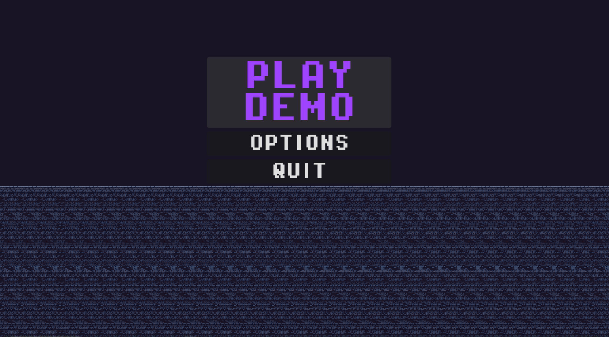
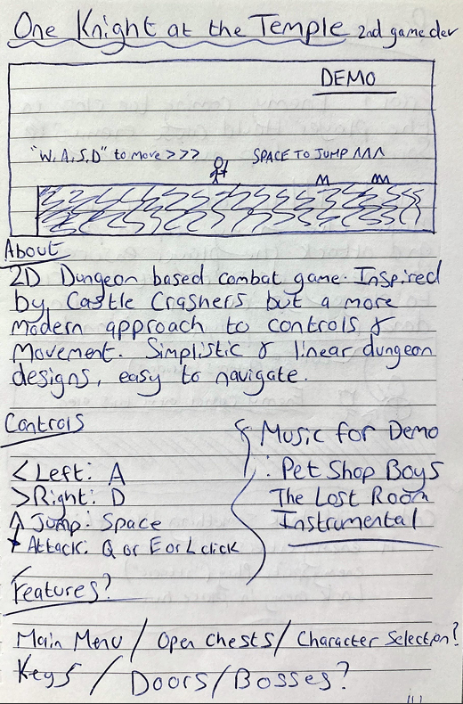
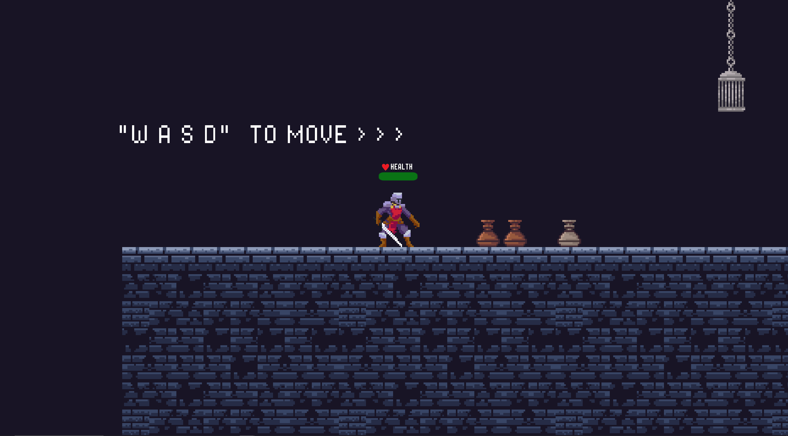

  <ol>
    <li>
      <a href="#about-my-game-demo">About My Game Demot</a>
    </li>
    <li><a href="#how-to-download-the-demo">How To Download The Demo</a></li>
    <li><a href="#how-to-play">How To Play</a></li>
    <li><a href="#contact">Contact</a></li>
  </ol>

<!-- ABOUT MY GAME DEMO -->
## About My Game Demo

WELCOME TO MY GAME DEMO FOR: 1 KNIGHT AT THE TEMPLE

 
Earlier this year around May/June time, I decided to pick up game development again. I first explored game development 2 years ago experimenting with the Unity game engine,
but found it a bit challenging getting used to the UI and how things worked. Thankfully I found the Godot game Engine, which is user friendly and very fun to use! I started thinking
of game ideas and one of them was a 2D dungeon based action combat game. This demo is no where near finished, but I decided to upload the project to my GitHub to track the process 
of my development. I usually work on this a couple times every few months, just whenever I feel like it and have some free time!

<!-- HOW TO DOWNLOAD THE DEMO -->
## How To Download The Demo

Just simply download and the .exe file called playDemo.exe, and the .pck file called playDemo.pck inside the playDemo folder. Then run the executable!

<!-- HOW TO PLAY -->
## How To Play

This game takes great inspiration from Castle Crashers but with a more modern style. The mechanics are simple, W A S D to move, SPACE to jump and E or Left Click to attack. The game
entails running through a linear dunegon, jumping over obstacles, killing enemies and opening chests for loot. The goal is to reach the end of each level. The levels will get more tough as they go along
so better loot will accomodate for this. 

<!-- CONTACT -->
## Contact

My Email - masonmurphy03@outlook.com

(<a href="#readme-top">back to top</a>)

